# Donor-to-Donor Variation in the NSCLC Immune Microenvironment Using Joint RNA + Surface-Protein Profiling

> Single-cell multi-modal (RNA + ADT) analysis of 9,103 immune cells across 7 NSCLC donors, revealing myeloid functional heterogeneity as the dominant axis of patient-to-patient variation in the tumor immune microenvironment.

---

## Highlights

<table>
<tr>
<td width="60%">

- **18 immune cell populations** identified via Weighted Nearest Neighbor (WNN) integration of RNA + surface protein
- **Myeloid compartment dominates** inter-donor heterogeneity — all 5 scored immune programs significant (4/5 with p < 0.001)
- **IFN/ISG signaling** is the single most variable program across patients (p = 1.27 × 10⁻⁸ in myeloid cells)
- **Donor 4** harbors a B cell–dominated TME (>60% B lineage), suggestive of tertiary lymphoid structures
- **Myeloid ambient RNA leak** confounds T cell scores and requires explicit correction — a key methodological finding

</td>
<td width="40%">

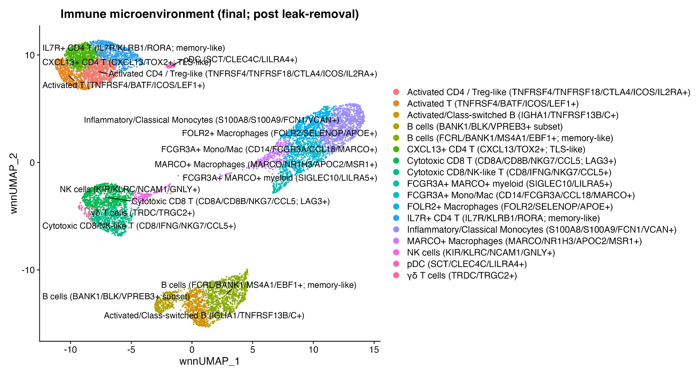
<em>Final annotated immune UMAP (18 cell types)</em>

</td>
</tr>
</table>

---

## Pipeline

This project implements an **18-step computational pipeline** in a single, self-contained R script:

```
 DATA LOADING          IMMUNE EXTRACTION         ANNOTATION              FUNCTIONAL ANALYSIS
 ─────────────         ─────────────────         ──────────              ───────────────────
 Step 1: Load 7        Step 6: Marker scan       Step 10: RNA + ADT      Step 14: Module scoring
   donors (HDF5)         (PTPRC vs EPCAM)          DotPlot validation      (5 gene programs)
 Step 2: QC filter     Step 7: Immune WNN        Step 11: FindAllMarkers  Step 15: Single-gene
 Step 3: RNA PCA         reprocessing              + labeling               validation
 Step 4: ADT APCA      Step 8: scDblFinder       Step 12: Remove          Step 16: Myeloid-leak QC
 Step 5: WNN UMAP        doublet removal           contamination          Step 17: Leak correction
   + clustering        Step 9: Singlet WNN                                Step 18: Final figures
                         reprocessing                                       + statistics
```

Every step produces checkpoint outputs (plots + tables) so results are fully traceable.

---

## Key Results

### Immune cell composition varies dramatically across donors

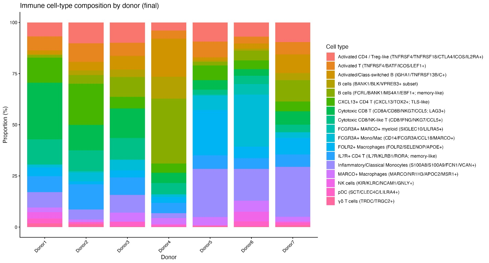

| Archetype | Donors | Key feature |
|-----------|--------|-------------|
| **B cell–dominated** | Donor 4 | >60% B lineage (31.7% memory B, 18.6% class-switched, 10.7% BANK1/BLK) |
| **T cell–enriched** | Donors 1, 2 | High CXCL13+ CD4 T (up to 20.2%), strong cytotoxic CD8 |
| **Myeloid-enriched** | Donors 5, 6 | High monocyte/macrophage fractions (up to 55%) |
| **Mixed** | Donors 3, 7 | Balanced representation across compartments |

### Five immune state programs scored

| Program | Genes | What it captures |
|---------|-------|------------------|
| **CYTOTOXICITY** | NKG7, GNLY, PRF1, GZMB, GZMH, CTSW, FCGR3A, CCL5 | Effector killing capacity |
| **EXHAUSTION** | PDCD1, LAG3, HAVCR2, TIGIT, CTLA4, TOX | Chronic activation / T cell dysfunction |
| **IFN_ISG** | ISG15, IFIT1, IFIT2, IFIT3, MX1, OAS1, STAT1, IRF7 | Interferon-stimulated response |
| **INFLAM_MYELOID** | S100A8, S100A9, FCN1, IL1B, LGALS3, LYZ, CTSS | Inflammatory monocyte activation |
| **TAM_MACRO** | APOE, C1QA, C1QB, C1QC, TREM2, MSR1, MRC1, MARCO | Tumor-associated macrophage polarization |

### Module scores localize to expected compartments

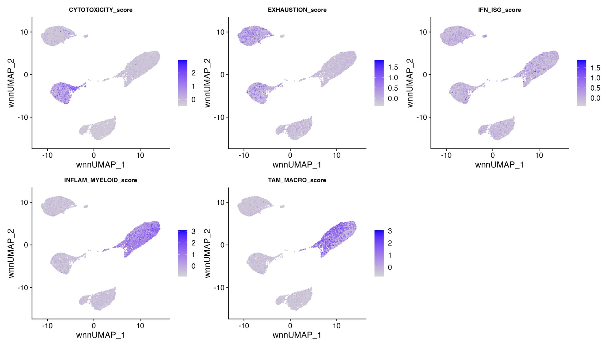

### Myeloid heterogeneity dominates inter-donor differences

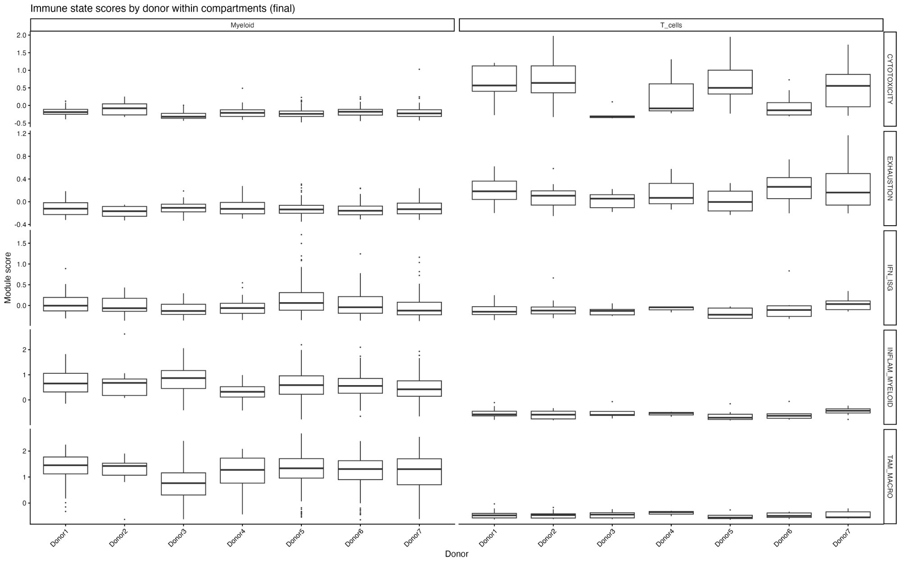

#### Kruskal–Wallis results (post myeloid-leak correction)

| Program | Myeloid (n=651) | T cells (n=64) | Myeloid donor ↑ | Myeloid donor ↓ |
|---------|:---------------:|:---------------:|:----------------:|:----------------:|
| **IFN_ISG** | **1.27 × 10⁻⁸** | 0.190 | Donor 5 | Donor 7 |
| **CYTOTOXICITY** | **3.27 × 10⁻⁶** | **0.005** | Donor 2 | Donor 5 |
| **INFLAM_MYELOID** | **5.65 × 10⁻⁵** | 0.341 | Donor 3 | Donor 7 |
| **TAM_MACRO** | **3.55 × 10⁻⁴** | 0.845 | Donor 1 | Donor 3 |
| EXHAUSTION | 0.269 | 0.465 | — | — |

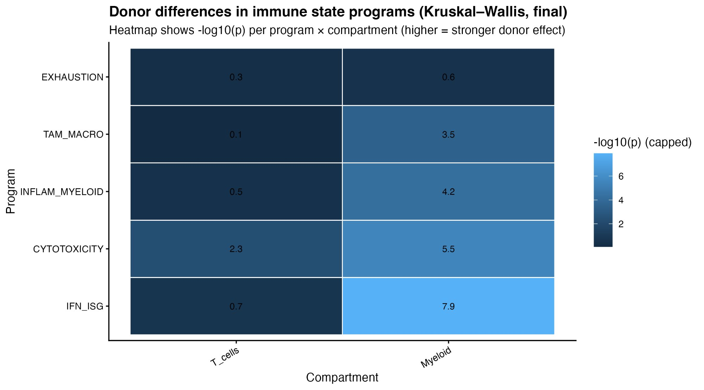

> **Bottom line:** All five programs show significant donor effects in myeloid cells. Only cytotoxicity is significant in T cells. IFN/ISG in myeloid cells is the single strongest signal (–log10(p) = 7.9).

---

## The 18 Immune Cell Types

| Cell Type | Key Markers | Compartment | Cells |
|-----------|-------------|:-----------:|------:|
| Inflammatory/Classical Monocytes | S100A8, S100A9, FCN1, VCAN | Myeloid | 1,151 |
| B cells (memory-like) | FCRL, BANK1, MS4A1, EBF1 | B cells | 909 |
| Cytotoxic CD8 T (LAG3+) | CD8A, CD8B, NKG7, CCL5, LAG3 | T cells | 834 |
| FCGR3A+ Mono/Mac | CD14, FCGR3A, CCL18, MARCO | Myeloid | 735 |
| Activated CD4 / Treg-like | TNFRSF4, TNFRSF18, CTLA4, ICOS, IL2RA | T cells | 712 |
| CXCL13+ CD4 T (TLS-like) | CXCL13, TOX2 | T cells | 686 |
| FOLR2+ Macrophages | FOLR2, SELENOP, APOE | Myeloid | 651 |
| IL7R+ CD4 T (memory-like) | IL7R, KLRB1, RORA | T cells | 636 |
| Activated/Class-switched B | IGHA1, TNFRSF13B/C | B cells | 606 |
| Cytotoxic CD8/NK-like T | CD8, IFNG, NKG7, CCL5 | T cells | 582 |
| Activated T | TNFRSF4, BATF, ICOS, LEF1 | T cells | 534 |
| B cells (BANK1/BLK subset) | BANK1, BLK, VPREB3 | B cells | 308 |
| MARCO+ Macrophages | MARCO, NR1H3, APOC2, MSR1 | Myeloid | 268 |
| NK cells | KIR, KLRC, NCAM1, GNLY | NK | — |
| FCGR3A+ MARCO+ myeloid | SIGLEC10, LILRA5 | Myeloid | — |
| pDC | SCT, CLEC4C, LILRA4 | DCs | — |
| γδ T cells | TRDC, TRGC2 | T cells | — |

---

## Intermediate Pipeline Figures

<details>
<summary><strong>Click to expand: QC, clustering, doublets, annotation evidence</strong></summary>

### Quality control by donor
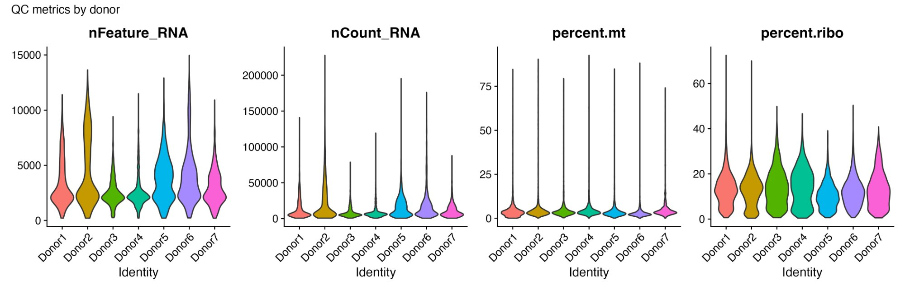

### Immune vs. non-immune separation (PTPRC / EPCAM)
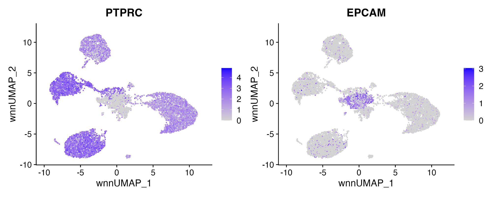

### Immune subclusters (pre-doublet)
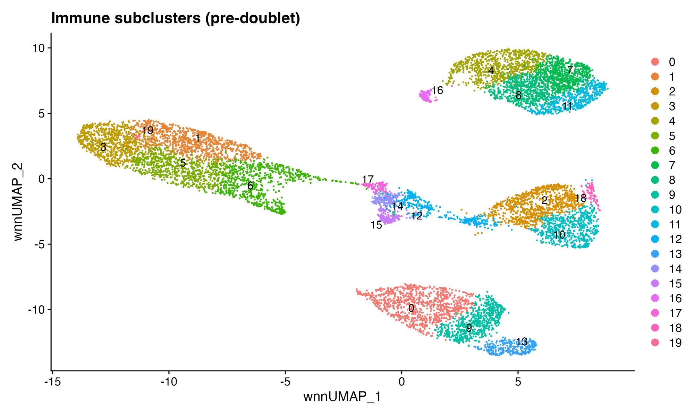

### Doublet detection (scDblFinder)
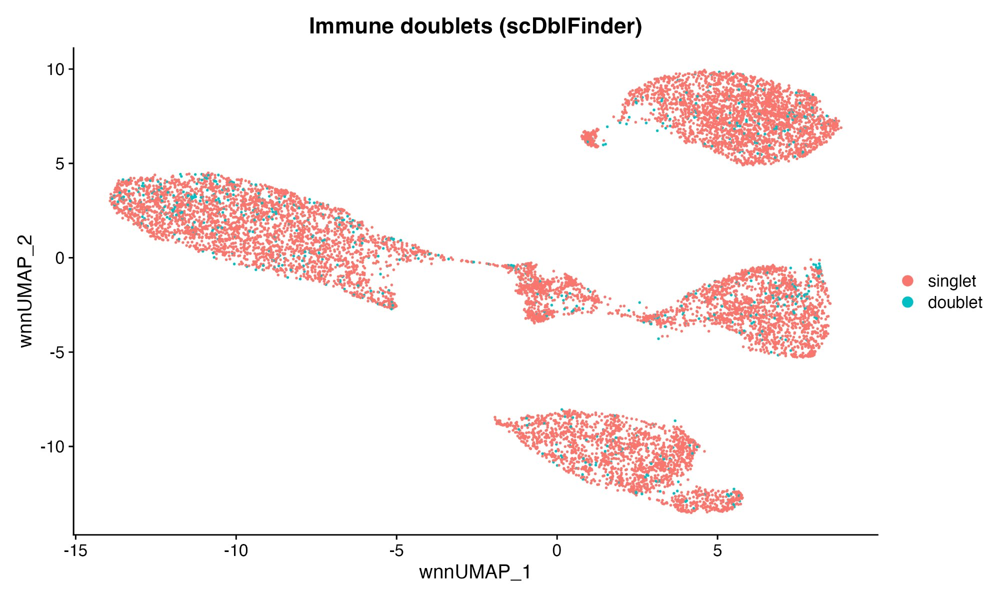

### Clean singlets (post-doublet)
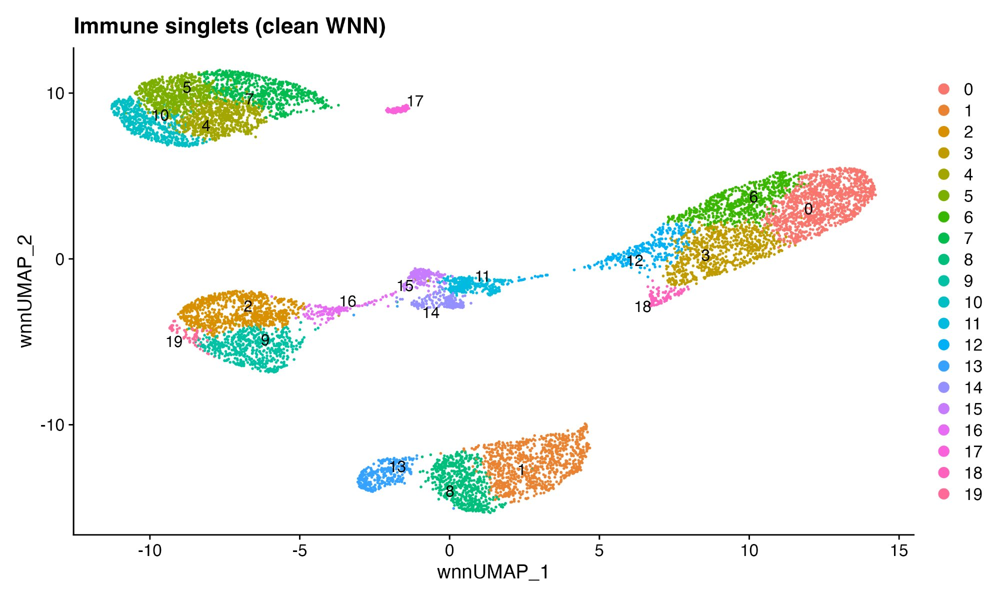

### RNA marker DotPlot (annotation evidence)
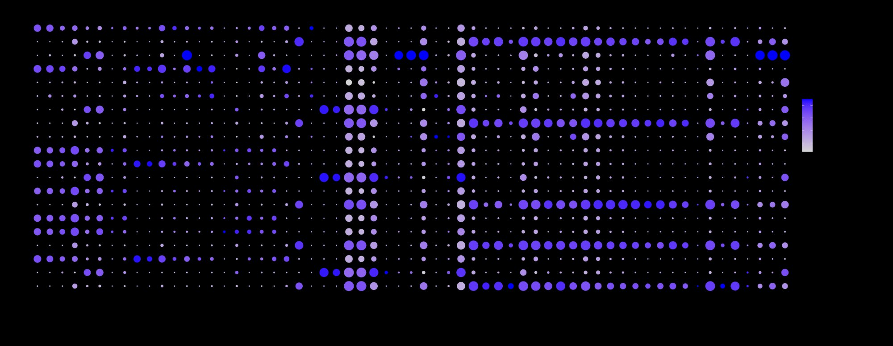

### ADT surface protein DotPlot
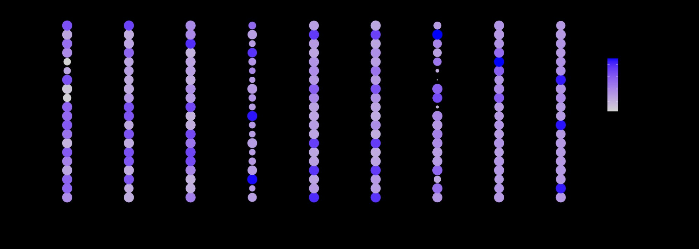

### Key lineage marker FeaturePlots
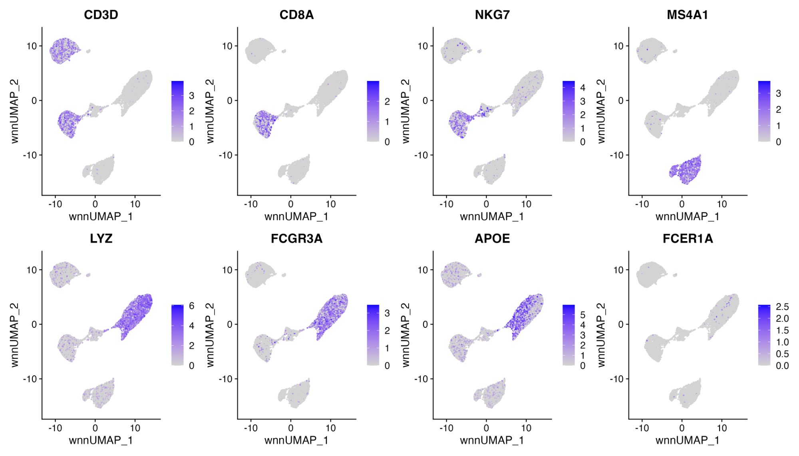

### Global state scores by donor (before compartment stratification)
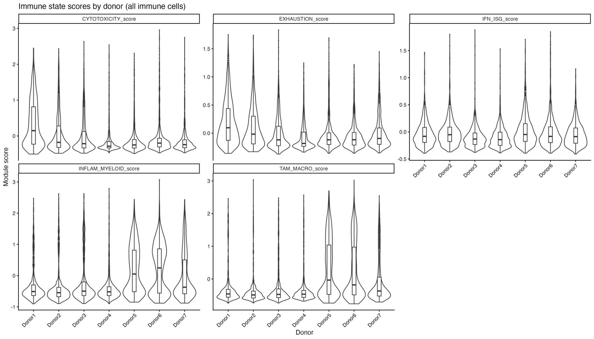

### Myeloid-leak QC within T cells
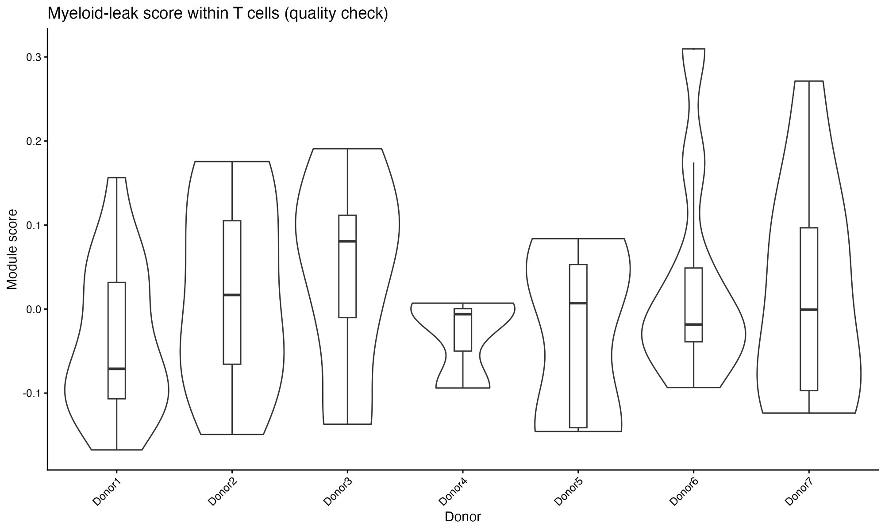

> The myeloid-leak score varies by donor in T cells, confirming that ambient RNA correction is necessary before inter-donor comparisons.

</details>

---

## Repository Structure

```
├── README.md                                    ← You are here
├── LICENSE
├── .gitignore
│
├── analysis/
│   └── NSCLC_immune_pipeline.R                  ← Full 18-step pipeline (1,528 lines)
│
├── results/
│   ├── final_plots/                             ← Publication-ready outputs
│   │   ├── A1_UMAP_celltype_FINAL.png
│   │   ├── B1_Composition_byDonor_FINAL.png
│   │   ├── C1_StateScores_UMAP_FINAL.png
│   │   ├── D1_StateScores_byDonor_WITHINcompartments_FINAL.png
│   │   ├── E2_KW_heatmap_neglog10p_FINAL.png
│   │   ├── B1_Composition_counts_FINAL.csv
│   │   ├── B1_Composition_percent_FINAL.csv
│   │   ├── E1_Kruskal_byDonor_withinCompartments_FINAL.csv
│   │   └── F1_TOP_hits_with_direction_FINAL.csv
│   │
│   ├── intermediate_plots/                      ← Step-by-step QC and validation
│   │   ├── STEP2_QC_violin_by_donor.png
│   │   ├── STEP3_RNA_PCA_elbow.png
│   │   ├── STEP6_marker_dotplot.png
│   │   ├── STEP7_immune_preDoublet_umap.png
│   │   ├── STEP8_immune_doublet_class_umap.png
│   │   ├── STEP9_immune_singlets_clean_umap.png
│   │   ├── STEP10_immune_RNA_marker_dotplot.png
│   │   ├── STEP10_immune_ADT_marker_dotplot.png
│   │   ├── STEP10_immune_featureplots_RNA.png
│   │   ├── STEP14A_stateScores_byDonor_GLOBAL.png
│   │   ├── STEP16_Tcells_MYELOID_LEAK_byDonor.png
│   │   └── feature_PTPRC_EPCAM.png
│   │
│   └── tables/                                  ← Marker genes and statistics
│       ├── STEP11_immune_FindAllMarkers.csv
│       ├── STEP13_immune_composition_counts.csv
│       ├── STEP13_immune_composition_percent.csv
│       ├── STEP14A_Kruskal_byDonor_withinCompartments.csv
│       ├── STEP14F_TOP_hits_with_direction.csv
│       └── STEP17_Kruskal_byDonor_withinCompartments_noLeakTcells.csv
│
├── report/
│   └── NSCLC_Immune_TME_Report.docx             ← Full written report
│
└── docs/
    ├── METHODS.md                               ← Extended pipeline details
    └── CELL_TYPE_ANNOTATIONS.md                 ← Per-cluster annotation evidence
```

---

## Dataset

**10x Genomics 20k NSCLC DTC 3' NextGEM** — publicly available from [10x Genomics Datasets](https://www.10xgenomics.com/datasets).

| Property | Value |
|----------|-------|
| Donors | 7 (Donor 1–7) |
| Modalities | Gene Expression (RNA) + Antibody Capture (ADT) |
| ADT markers | CD45, CD3, CD4, CD8, CD14, CD11c, CD16, CD56, CD19 |
| Chemistry | 3' NextGEM v3.1 |
| Final immune cells | 9,103 singlets |

### Downloading the data

```bash
mkdir -p data && cd data

# Download all 7 donor HDF5 files
for i in $(seq 1 7); do
  wget "https://cf.10xgenomics.com/samples/cell-exp/7.0.0/\
20k_NSCLC_DTC_3p_nextgem_intron_Multiplex/\
20k_NSCLC_DTC_3p_nextgem_intron_donor_${i}_count_sample_feature_bc_matrix.h5"
done
```

> Check the [10x Genomics website](https://www.10xgenomics.com/datasets) for current download URLs.

---

## Requirements

### R packages

```r
# CRAN
install.packages(c("Seurat", "dplyr", "ggplot2", "patchwork",
                    "tibble", "tidyr", "readr", "stringr", "Matrix"))

# Bioconductor
BiocManager::install(c("scDblFinder", "SingleCellExperiment"))
```

### Tested versions

| Package | Version |
|---------|---------|
| R | ≥ 4.3 |
| Seurat | 5.x |
| scDblFinder | 1.12+ |
| ggplot2 | 3.4+ |

---

## Running the Analysis

```bash
# 1. Clone
git clone https://github.com/YOUR_USERNAME/NSCLC-immune-TME.git
cd NSCLC-immune-TME

# 2. Download data (see above) and place HDF5 files in your working directory

# 3. Update the working directory path in the script (line 15):
#    setwd("~/Desktop/10Xdata")  →  setwd("/your/data/path")

# 4. Run
Rscript analysis/NSCLC_immune_pipeline.R
```

The script creates a timestamped `RUN_YYYYMMDD_HHMMSS/` folder with all outputs. A `FINAL_PLOTS_STEP18/` subfolder contains publication-ready figures and tables.

### Running interactively

The script is designed for step-by-step execution in RStudio. Each step saves intermediate `.rds` checkpoints to the run folder, so you can resume from any step after interruption. These checkpoints are local working files and are excluded from the repository via `.gitignore`.

---

## Reproducibility

| Feature | Implementation |
|---------|---------------|
| **Random seed** | `set.seed(1)` at script start and key stochastic steps |
| **Timestamped runs** | Unique `RUN_YYYYMMDD_HHMMSS/` folder per execution |
| **Checkpointing** | Every step saves/loads `.rds` files (local, not tracked in git) |
| **Self-contained** | Single R script, no external dependencies beyond listed packages |

---

## Methods Summary

1. **Data loading**: 7 donors × 2 modalities (RNA + ADT) from 10x HDF5 files
2. **QC**: Filter on gene count (200–7,500) and mitochondrial content (<20%)
3. **Integration**: WNN (Weighted Nearest Neighbor) combining 30 RNA PCs + 5 ADT PCs
4. **Immune extraction**: PTPRC+ clusters separated from EPCAM+ epithelial and COL1A1+ stromal
5. **Doublet removal**: scDblFinder on immune subset; singlets reprocessed
6. **Annotation**: Convergent evidence from FindAllMarkers + RNA DotPlot + ADT DotPlot
7. **Contamination removal**: 3 non-immune clusters excluded (endothelial, epithelial, neuroendocrine)
8. **State scoring**: 5 gene programs via AddModuleScore
9. **Myeloid-leak correction**: Ambient myeloid RNA quantified and removed from T cells
10. **Statistics**: Kruskal–Wallis tests within compartments; effect direction analysis

For full details, see [docs/METHODS.md](docs/METHODS.md) and [docs/CELL_TYPE_ANNOTATIONS.md](docs/CELL_TYPE_ANNOTATIONS.md).

---

## Citation

```
Donor-to-Donor Variation in the NSCLC Immune Microenvironment Using
Joint RNA + Surface-Protein Profiling. (2026).
GitHub: https://github.com/YOUR_USERNAME/NSCLC-immune-TME
```

---

## License

MIT License — see [LICENSE](LICENSE) for details.

Dataset provided by 10x Genomics under their [dataset license](https://www.10xgenomics.com/datasets).
